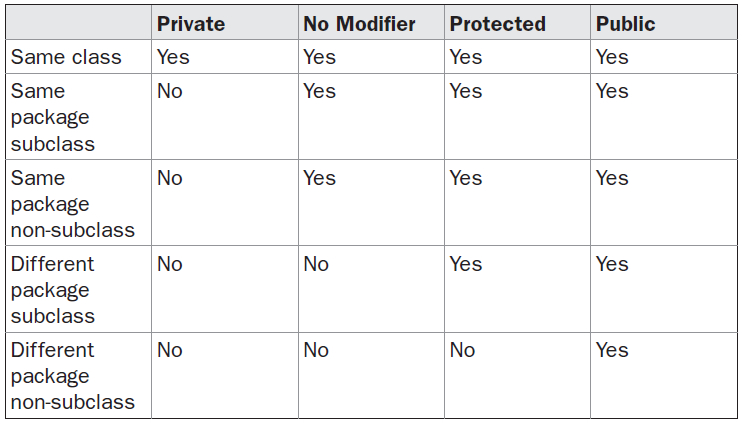

# Packages
  
* These are containers for classes that are used to keep the class namespace compartmentalized.  
* It is both a naming ad a visibility control mechanism.  
* Defining a package :
```
package package_name;
... classes ......

Any class written under it is saved in that package.
```
* JAVA uses file system directories to store packages.  
  
**Access Protection**
  

   
**Import statement**
  
* to bring certain classes or entire package into visibility.  
* Syntax:
```
import package_name.sub_package.class_name;   // for a particular class
import package_name.sub_package.*;            // imports all classes in the sub_package
```
  
* import java.lang; is the default import statement automatically included in all the programs we write.  
* import statement for a class is optional , we can rather use a fully qualified path to the class.
